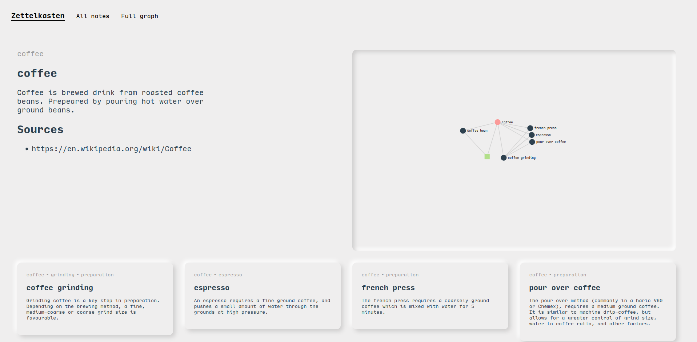

# Zettelkasten

Note taking method devised by Niklas Luhmann.  It is essentially a graph database of notes. See [https://www.zettlr.com/post/what-is-a-zettelkasten](https://www.zettlr.com/post/what-is-a-zettelkasten) for a more in-depth description.

Each note should contain one concept/idea, has to link to other notes, and have tags.  

## Scripts
I have three scripts to ease the use of the Zettelkasten:

* `make-note.sh` takes a name and creates a new note.
* `link-search.sh` takes the name of a note and outputs the notes that link to it.
* `tag-search.sh` takes the name of a tag and outputs all notes with that tag.

## Visualisation
Graph visualisation of the zettelkasten is implemented via [plotly dash]https://plotly.com/dash/). Install the framework via (in a virtual environment)

```sh
pip install .
```

And then run:

```sh
zettlekasten
```

in a directory containing markdown notes following the style created by `make-note.sh`.

You can view the zettelkasten in your browser on [localhost:8050/all-notes](http://localhost:8050/all-notes).



## Configuration
There is a configuration file (`.editor`) for where to automatically open files created by `make-note.sh`.  It defaults to your `$EDITOR` , but maybe [zettlr](https://www.zettlr.com/), which is a great markdown editor (with Zettelkasten support), is more to your liking.
